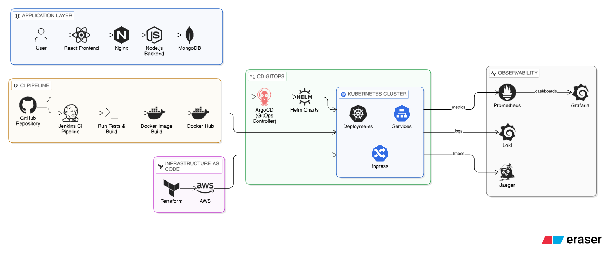

# 💬 Full Stack Realtime Chat Application



A production-ready, enterprise-grade chat application showcasing modern DevOps practices and cloud-native architecture. This project demonstrates end-to-end CI/CD pipelines, infrastructure as code, container orchestration, and comprehensive observability.

## 🏗️ Architecture Overview

Our application follows a microservices architecture with complete separation of concerns and enterprise-grade DevOps practices:

### **Application Layer**
- **React Frontend** - Modern, responsive UI with real-time updates
- **Nginx Reverse Proxy** - Load balancing and static asset serving
- **Node.js Backend** - RESTful API with WebSocket support
- **MongoDB** - NoSQL database for message storage

### **CI/CD Pipeline**
- **GitHub Repository** - Source code management and version control
- **Jenkins CI Pipeline** - Automated testing, building, and security scanning
- **Docker Hub** - Container registry for image distribution
- **Multi-environment deployments** (Staging/Production)

### **GitOps & Deployment**
- **ArgoCD** - GitOps continuous deployment
- **Helm Charts** - Kubernetes package management
- **Kubernetes Cluster** - Container orchestration with Deployments, Services, and Ingress

### **Infrastructure as Code**
- **Terraform** - AWS cloud infrastructure provisioning
- **Automated resource management** - VPC, EC2, DocumentDB, and networking

### **Observability Stack**
- **Prometheus** - Metrics collection and monitoring
- **Grafana** - Rich dashboards and visualization
- **Loki** - Log aggregation and querying
- **Jaeger** - Distributed tracing for microservices

## 🚀 Technology Stack

### **Frontend**
- **React 18** - Modern UI framework
- **Vite** - Fast development and build tool
- **TailwindCSS + DaisyUI** - Utility-first CSS framework
- **Socket.io Client** - Real-time communication
- **Axios** - HTTP client for API calls
- **Zustand** - State management

### **Backend**
- **Node.js 20** - JavaScript runtime
- **Express.js** - Web framework
- **Socket.io** - Real-time WebSocket communication
- **MongoDB/Mongoose** - Database and ODM
- **JWT** - Authentication and authorization
- **Cloudinary** - Image upload and storage
- **Winston** - Structured logging
- **Prometheus Client** - Metrics collection

### **DevOps & Infrastructure**
- **Docker** - Containerization
- **Kubernetes** - Container orchestration
- **Jenkins** - CI/CD pipeline automation
- **ArgoCD** - GitOps deployment
- **Terraform** - Infrastructure as Code
- **Helm** - Kubernetes package management
- **AWS** - Cloud infrastructure

### **Observability**
- **Prometheus** - Metrics monitoring
- **Grafana** - Visualization dashboards
- **Loki** - Log aggregation
- **Jaeger** - Distributed tracing
- **Artillery** - Performance testing

## 🛠️ Quick Start

### **Prerequisites**
- Docker and Docker Compose
- Node.js 20+
- Kubernetes cluster (minikube/local or cloud)
- kubectl configured
- Terraform (for infrastructure)

### **Local Development**

```bash
# Clone the repository
git clone https://github.com/Kalaigar-Ayesha/Chat-application.git
cd Chat-application

# Start development environment
docker-compose up -d

# Install dependencies
npm run build

# Start development servers
npm run dev
```

### **Production Deployment**

```bash
# Provision infrastructure
cd terraform
terraform init
terraform plan
terraform apply

# Deploy to Kubernetes
cd ..
kubectl apply -f kubernetes/

# Or use Helm
helm install chat-app ./Helm
```

## 🔄 CI/CD Pipeline

Our comprehensive pipeline includes:

### **Automated Testing**
- **Unit Tests** - Jest for backend, Vitest for frontend
- **Integration Tests** - Postman/Newman API testing
- **Performance Tests** - Artillery load testing
- **Security Scanning** - npm audit and vulnerability checks

### **Quality Gates**
- **Code Coverage** - Minimum 80% coverage requirement
- **Linting** - ESLint for code quality
- **Build Verification** - Successful compilation and packaging

### **Deployment Strategy**
- **Staging Environment** - Automatic deployment on develop branch
- **Production Environment** - Manual approval required
- **Rollback Capability** - Automatic rollback on failures
- **Health Checks** - Post-deployment verification

## 📊 Monitoring & Observability

### **Metrics Dashboard**
- **Application Metrics** - Request latency, error rates, active users
- **Infrastructure Metrics** - CPU, memory, network usage
- **Business Metrics** - User registrations, message volume

### **Logging**
- **Structured Logs** - JSON format with correlation IDs
- **Log Aggregation** - Centralized logging with Loki
- **Log Analysis** - Query and filter capabilities

### **Tracing**
- **Distributed Tracing** - Request flow across services
- **Performance Analysis** - Bottleneck identification
- **Service Dependencies** - Service map visualization

## 🔧 Configuration

### **Environment Variables**
```bash
# Backend Configuration
NODE_ENV=production
PORT=5000
MONGODB_URI=mongodb://localhost:27017/chatapp
JWT_SECRET=your-jwt-secret
CLOUDINARY_URL=your-cloudinary-url

# Frontend Configuration
VITE_API_URL=http://localhost:5000
VITE_WS_URL=ws://localhost:5000
```

### **Kubernetes Configuration**
```bash
# Namespace
kubectl create namespace chat-app

# Deploy all services
kubectl apply -f kubernetes/ -n chat-app

# Check deployment status
kubectl get pods -n chat-app
```

## 🧪 Testing

### **Run Tests Locally**
```bash
# Backend tests
cd backend
npm test
npm run test:coverage

# Frontend tests
cd frontend
npm test
npm run test:coverage

# Integration tests
cd tests/api
newman run postman-collection.json

# Performance tests
cd tests/performance
artillery run load-test.yml
```

## 📈 Performance

### **Benchmarks**
- **API Response Time** < 200ms (95th percentile)
- **WebSocket Latency** < 50ms
- **Concurrent Users** 1000+ supported
- **Message Throughput** 10,000+ messages/second

### **Scaling**
- **Horizontal Pod Autoscaling** - Automatic scaling based on CPU/memory
- **Database Sharding** - MongoDB horizontal scaling
- **CDN Integration** - Static asset delivery
- **Load Balancing** - Multiple instance support

## 🔒 Security

### **Implementation**
- **JWT Authentication** - Secure token-based auth
- **Input Validation** - XSS and SQL injection prevention
- **Rate Limiting** - API abuse prevention
- **HTTPS Enforcement** - Secure communication
- **Environment Variables** - Secret management

### **Best Practices**
- **Regular Security Updates** - Dependency management
- **Vulnerability Scanning** - Automated security checks
- **Access Control** - Role-based permissions
- **Audit Logging** - Security event tracking

## 🤝 Contributing

1. Fork the repository
2. Create a feature branch (`git checkout -b feature/amazing-feature`)
3. Commit your changes (`git commit -m 'Add amazing feature'`)
4. Push to the branch (`git push origin feature/amazing-feature`)
5. Open a Pull Request

### **Development Guidelines**
- Follow existing code style
- Add tests for new features
- Update documentation
- Ensure CI/CD pipeline passes

## 📝 License

This project is licensed under the ISC License - see the [LICENSE](LICENSE) file for details.

## 🙏 Acknowledgments

- **MERN Stack** - For the amazing technology stack
- **Socket.io** - Real-time communication capabilities
- **Kubernetes** - Container orchestration platform
- **DevOps Community** - Best practices and inspiration

## 📞 Support

For support and questions:
- Create an issue on GitHub
- Join our Discord community
- Check the documentation

---

**Built with ❤️ by the DevOps Team**


